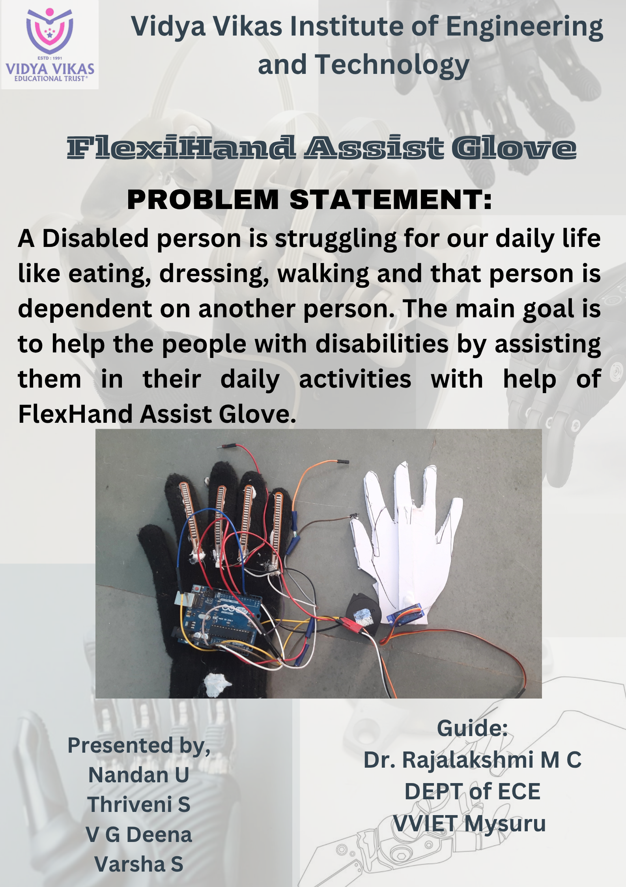
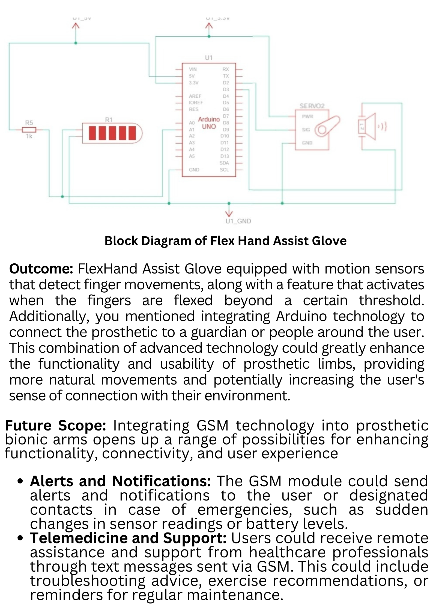

# 🦾 FlexiHand Assist Glove  
### Vidya Vikas Institute of Engineering and Technology, Mysuru  
#### Department of Electronics and Communication Engineering  

---

## 💡 Problem Statement  
A disabled person struggles in daily life — eating, dressing, walking — and depends on others.  
The main goal of **FlexiHand Assist Glove** is to help such people perform their daily activities independently using smart motion sensors and servo assistance.

---

## ⚙️ Block Diagram  
  

---

## 🧠 Outcome  
**FlexHand Assist Glove** is equipped with motion sensors that detect finger movements.  
It activates when fingers flex beyond a threshold, using Arduino-based control.  
The system can connect to a guardian or support person for enhanced safety and independence.

---

## 🚀 Future Scope  
- **GSM Integration:** Alerts and notifications for emergencies.  
- **Telemedicine Support:** Remote monitoring and guidance.  
- **Voice/gesture control:** Improved interactivity.  
- **Lightweight wearable design:** For everyday comfort.  

---

## 🧑‍🤝‍🧑 Team Members  
- **Nandan U**  
- **Thriveni S**  
- **V. G. Deena**  
- **Varsha S**  

**Guide:** Dr. Rajalakshmi M. C  
**Department:** ECE  
**Institution:** VVIET Mysuru  

---

## 🏆 Acknowledgement  
We sincerely thank **Vidya Vikas Institute of Engineering and Technology, Mysuru**,  
and our guide **Dr. Rajalakshmi M. C** for their invaluable support and guidance.

---

## 📚 License  
This project is part of an academic initiative at **VVIET Mysuru**.  
Use or modify for educational and research purposes.
